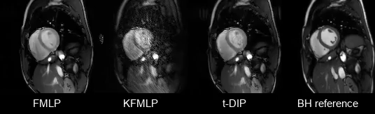
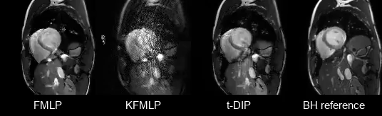

# Implicit Neural Networks with Fourier-Feature Inputs for Free-breathing Cardiac MRI Reconstruction

## Updates

## Setup

## Datasets

## Licence

## Contact

## Supplementary materials
### Reconstructed videos

#### Low-resolution high-SNR dataset

*Reconstructions by the FMLP using different acquisition lengths*

#### Low-resolution low-SNR dataset

#### High-resolution dataset

