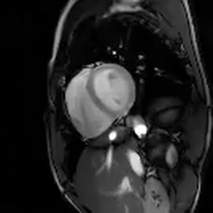

# Implicit Neural Networks with Fourier-Feature Inputs for Free-breathing Cardiac MRI Reconstruction

## Updates

## Setup

## Datasets

## Licence

## Contact

## Supplementary materials
### Reconstructed videos

#### Low-resolution high-SNR dataset

*Reconstructions using different acquisition lengths*

4 seconds:

8 seconds:

16 seconds:
