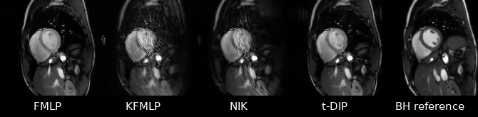
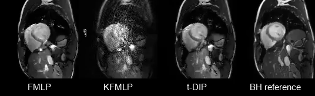

# Implicit Neural Networks with Fourier-Feature Inputs for Free-breathing Cardiac MRI Reconstruction

This repository contains the code for reproducing figures and results in the paper ``Implicit Neural Networks with Fourier-Feature Inputs for Free-breathing Cardiac MRI Reconstruction''.

## Citation
```
@article{heckel_yilmaz_2020,
    author    = {Johannes F. Kunz and Stefan Ruschke and Reinhard Heckel},
    title     = {Implicit Neural Networks with Fourier-Feature Inputs for Free-breathing Cardiac MRI Reconstruction},
    journal   = {	arXiv:2305.06822},
    year      = {2023}
}
```


## Setup
1. Setup a docker container with support for Nvidia GPUs and pytorch. 
2. Install additional packages
```bash
chmod +x ./setup/setup.sh
./setup/setup.sh
```
3. Download the datasets and copy them into the `data` folder in your project.
4. Configure and run the experiment scripts in the `experiments/` folder.

## Datasets
The low-resolution high-SNR, the low-resolution low-SNR, and the high-resolution dataset are available on IEEEDataPort, see [https://dx.doi.org/10.21227/f057-dw29](https://dx.doi.org/10.21227/f057-dw29). The datasets need to be copied into the data folder of the project.

## Licence

##  Reconstructed videos
#### Low-resolution high-SNR dataset
The video below shows the reconstructions of the low-resolution high-SNR dataset by the FMLP, the KFMLP, and the t-DIP for an acquisition time of $4s$ ($T = 225$). An ECG-gated breath-hold (BH) dataset was reconstructed using classical sparsity-based methods and is shown as visual reference. It can be seen that the reconstruction quality of the FMLP and the t-DIP are on par, whereas the KFMLP suffers aliasing-like artifacts.




##### Reconstructions by the FMLP using different acquisition lengths
For the video below, the FMLP was trained on three different acquisition lengths $4s$ ($T=225$), $8s$ ($T=512$), and $16s$ ($T=900$). It can be seen that the visual reconstruction quality does not improve notably with increased acquistion time.


#### Low-resolution low-SNR dataset
The low-resoltion low-SNR dataset was reconstructed by the FMLP, the KFMLP, and the t-DIP for an acquisition time of $4s$ ($T = 225$). It can be seen below that the reconstruction quality of the FMLP and the t-DIP is similar and both methods exhibit similar artifacts. The KFMLP, by contrast, exhibits aliasing-like artifacts and high-frequency noise. 



#### High-resolution dataset
The reconstructions of high-resolution dataset for an acquisition time of $4s$ ($T=225$) are depricted below. Again, the FMLP and the t-DIP are similar in image quality. The KFMLP's reconstruction is obscured substantially by noise.


## Licence

All files are provided under the terms of the Apache License, Version 2.0.
