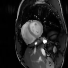

# Implicit Neural Networks with Fourier-Feature Inputs for Free-breathing Cardiac MRI Reconstruction

In this paper we propose an approach for cardiac magnetic resonance imaging (MRI), which aims to reconstruct a video of a moving heart from highly undersampled measurements taken continuously while the heart is beating. This task is challenging since the object to be reconstructed (the heart) is continuously changing during signal acquisition. To address this challenge, we represent the moving heart with an implicit neural network and fit the network so that the heart is consistent with the measurements. 
The network in form of a multi-layer perceptron with Fourier-feature inputs acts as an effective signal prior and enables adjusting the regularization strength in the spatial and temporal dimensions of the signal.
We examine the proposed approach for 2D free-breathing cardiac real-time MRI in different operating regimes, i.e., for different image resolutions, slice thicknesses, and acquisition lengths. We find that our method achieves comparable reconstruction quality to state-of-the-art untrained convolutional neural networks (CNNs) and superior image quality compared to a recent method that fits an implicit representation directly to Fourier-domain measurements.
%We achieve similar reconstruction quality as a state-of-the-art untrained convolutional neural networks (CNNs),  and better image quality than a recent approach that fits an implicit representation directly to the measurements in the Fourier domain. However, this comes at a higher computational cost. 
Importantly, our approach does not require any additional patient data or bio sensors including electrocardiography, making it potentially applicable in a wider range of clinical scenarios. 

## Updates

## Setup

## Datasets

## Licence

## Contact

## Supplementary materials
### Reconstructed videos

#### Low-resolution high-SNR dataset

